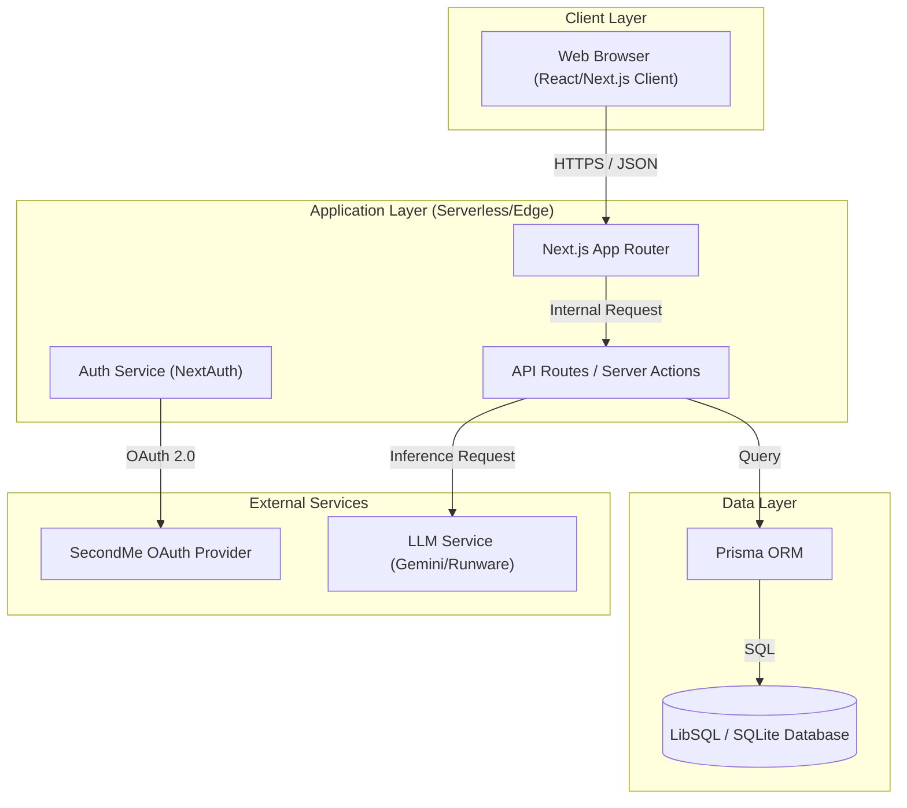
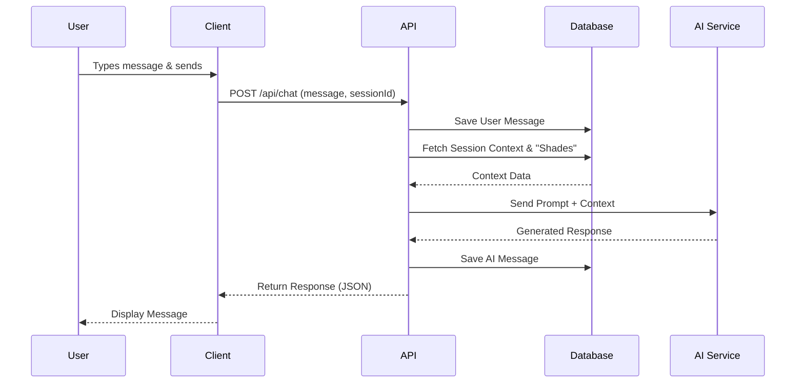

# System Architecture: Second Me v2

## Overview

**Second Me v2** is a Next.js-based web application designed to create a "digital twin" of the user. The system leverages AI to model personality traits ("Shades"), facilitates automated chat interactions, and computes compatibility scores between users. It aims to provide seamless, high-fidelity digital representation and social connectivity through a modern, responsive interface.

## Key Requirements

*   **Real-time Interaction:** Low-latency chat responses simulating natural conversation.
*   **Scalability:** Ability to handle concurrent user sessions and chat history growth.
*   **Data Integrity:** Secure storage of user profiles, authentication tokens, and chat logs.
*   **Modularity:** Clean separation of concerns (UI, API, Data Access) to support future feature additions like mobile apps or voice integration.
*   **Security:** OAuth-based authentication and secure handling of sensitive user data.

## High-Level Architecture

The system follows a monolithic architecture built on the Next.js framework, deploying both the frontend and backend as a unified application. It interacts with a relational database (SQLite/LibSQL) for persistence and external AI services for intelligence.

### Explanation

*   **Client Layer:** The user's browser runs the React-based frontend, handling UI rendering and state management.
*   **Application Layer:** The Next.js server handles routing, SSR (Server-Side Rendering), and API endpoints. Authentication logic resides here.
*   **Data Layer:** Prisma ORM manages interactions with the LibSQL/SQLite database, ensuring type-safe queries.
*   **External Services:** The system relies on SecondMe for identity verification and AI providers for generating content.

## Component Details

### 1. Web Client (Frontend)
*   **Responsibilities:** Rendering UI components, managing local state (React Context/Zustand), handling user input, and displaying real-time updates.
*   **Technologies:** Next.js 16 (App Router), React 19, Tailwind CSS v4.
*   **Communication:** Communicates with the backend via REST API calls (fetch) and Server Actions.

### 2. API Gateway / Backend (Next.js API Routes)
*   **Responsibilities:** Request validation, business logic execution (e.g., chat processing, matchmaking algorithms), and data orchestration.
*   **Technologies:** Node.js / Edge Runtime.
*   **Data Owned:** Transient session data, API response structures.
*   **Communication:** Receives requests from the Client; validates tokens with Auth Service; queries Database via Prisma.

### 3. Database
*   **Responsibilities:** Persistent storage of structured data.
*   **Technologies:** LibSQL (Production) / SQLite (Development).
*   **Data Owned:**
    *   **Users:** Profiles, OAuth tokens, "Shades" configuration.
    *   **ChatSessions:** Metadata for conversation threads.
    *   **ChatMessages:** History of interactions.
    *   **MatchCompatibility:** Scores and reasoning between users.

### 4. AI Orchestration Service (Internal Module)
*   **Responsibilities:** Constructing prompts based on user "Shades", managing context window for LLMs, and parsing AI responses.
*   **Technologies:** TypeScript, External LLM APIs.
*   **Communication:** Called by API Routes during chat interactions.

## Data Flow

### User Chat Interaction

This flow describes how a user sends a message to their digital twin or a matched profile.

## Data Model (High-Level)

*   **User:** The core entity. Contains identity info (`secondmeUserId`), authentication tokens (`accessToken`, `refreshToken`), and profile details (`nickname`, `avatar`).
*   **ChatSession:** Represents a conversation thread. Links a `User` to multiple `ChatMessages`. Stores `lastMessage` for quick previews.
*   **ChatMessage:** Individual messages within a session. Stores `content`, `role` (user/assistant), and timestamps.
*   **MatchCompatibility:** A join entity storing the compatibility `score` and `reasoning` between two `User` entities.

## Infrastructure & Deployment

*   **Platform:** Vercel (recommended) or any Docker-compatible container orchestration platform (e.g., Railway, AWS ECS).
*   **Database:** LibSQL (Turso) for serverless, edge-compatible database hosting.
*   **Environments:**
    *   **Development:** Local SQLite file (`dev.db`), local `.env` configuration.
    *   **Production:** Hosted LibSQL instance, secure environment variables for API keys and secrets.

## Scalability & Reliability

*   **Serverless:** Next.js API routes scale automatically with demand on platforms like Vercel.
*   **Database:** LibSQL/Turso provides replication and edge-caching capabilities to reduce latency and handle read-heavy loads.
*   **Connection Pooling:** Prisma utilizes connection pooling to manage database connections efficiently in serverless environments.

## Security & Compliance

*   **Authentication:** Strictly handled via OAuth 2.0 (SecondMe provider). No local password storage.
*   **Data Protection:** Access and Refresh tokens are stored securely in the database. API endpoints are protected via session verification.
*   **Input Validation:** All API inputs are validated (e.g., using Zod) to prevent injection attacks and ensure data integrity.

## Observability

*   **Logging:** Server-side logging for API errors and system events (console logs in dev, integrated logging in prod).
*   **Metrics:** Vercel Analytics / web vitals for frontend performance.
*   **Tracing:** Next.js built-in instrumentation for performance bottlenecks.

## Trade-offs & Decisions

*   **Monolith vs. Microservices:** Chose a monolithic Next.js structure to maximize development velocity and simplify deployment. The complexity of the current feature set does not yet warrant a distributed microservices architecture.
*   **SQLite/LibSQL:** Selected for simplicity and "serverless" alignment. While traditional PostgreSQL is powerful, LibSQL offers a better developer experience for this scale and architecture.

## Future Improvements

*   **Vector Database Integration:** Migrating user memory to a vector store (e.g., Pinecone, pgvector) for semantic search and long-term memory retrieval.
*   **WebSocket Integration:** Upgrading the chat from HTTP polling/request-response to WebSockets for true real-time bi-directional communication.
*   **Redis Caching:** Implementing a caching layer for user profiles and frequent compatibility checks to reduce database load.
